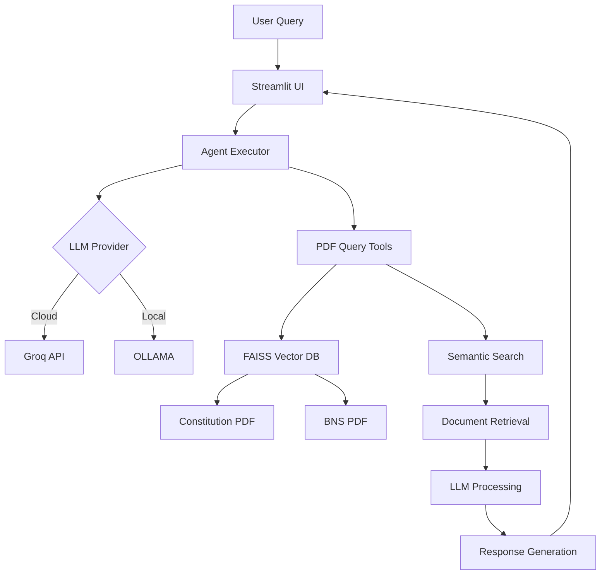

# VerdictAI ⚖️ - RAG-Based Legal Chatbot

A sophisticated AI-powered legal assistant that provides accurate answers about Indian laws and constitutional provisions using Retrieval-Augmented Generation (RAG) technology. Built with LangChain, Groq, and Streamlit, it offers both cloud and local LLM options for maximum flexibility.

## 🚀 Features

- **🤖 Dual LLM Support**: Choose between Groq (cloud) or OLLAMA (local) for AI processing
- **📚 Comprehensive Legal Database**: Access to Indian Constitution and Bharatiya Nyaya Sanhita (BNS) 2023
- **🔍 Semantic Search**: Advanced RAG implementation with FAISS vector database
- **💬 Interactive Chat Interface**: Clean, user-friendly Streamlit web interface
- **⚡ High Performance**: Optimized for fast responses with proper timeouts and error handling
- **🔄 Fallback Mechanisms**: Graceful degradation when services are unavailable
- **🐳 Docker Support**: Easy deployment with Docker and Docker Compose
- **📱 Real-time Model Switching**: Switch between different LLM providers on the fly

## 📋 Table of Contents

- [Installation](#installation)
- [Configuration](#configuration)
- [Usage](#usage)
- [Architecture](#architecture)
- [API Requirements](#api-requirements)
- [Docker Deployment](#docker-deployment)
- [Troubleshooting](#troubleshooting)
- [Contributing](#contributing)
- [License](#license)

## 🛠 Installation

### Prerequisites

- Python 3.8 or higher
- Git
- Docker (optional, for containerized deployment)

### Local Installation

1. **Clone the repository**
   ```bash
   git clone <repository-url>
   cd RAG-Based-Chatbot/Chatbot
   ```

2. **Create virtual environment**
   ```bash
   python -m venv venv
   source venv/bin/activate  # On Windows: venv\Scripts\activate
   ```

3. **Install dependencies**
   ```bash
   pip install -r requirements.txt
   ```

4. **Set up environment variables**
   ```bash
   cp .env.example .env  # Create .env file
   # Edit .env with your API keys
   ```

## ⚙️ Configuration

### Environment Variables

Create a `.env` file in the project root:

```bash
# Groq Configuration (Primary LLM Provider)
GROQ_API_KEY=your_groq_api_key_here

# HuggingFace Configuration (for embeddings)
HUGGINGFACE_API_KEY=your_huggingface_api_key_here

# OLLAMA Configuration (Optional - for local LLM)
USE_OLLAMA=false
OLLAMA_BASE_URL=http://localhost:11434
OLLAMA_MODEL=llama3.1:8b
```

### API Keys Setup

1. **Groq API**: 
   - Sign up at [console.groq.com](https://console.groq.com)
   - Get your API key from the dashboard
   - Free tier: 14,400 requests/day

2. **HuggingFace API** (Optional):
   - Sign up at [huggingface.co](https://huggingface.co)
   - Get your API token from settings
   - Used for downloading embedding models

3. **OLLAMA** (Optional - for local deployment):
   - Install OLLAMA from [ollama.ai](https://ollama.ai)
   - Pull models: `ollama pull llama3.1:8b`

## 🚀 Usage

### Running the Application

1. **Start the Streamlit app**
   ```bash
   streamlit run app.py
   ```

2. **Access the application**
   - Open your browser to `http://localhost:8501`
   - Choose your preferred LLM provider in the sidebar
   - Start asking legal questions!

### Example Queries

- "What are the fundamental rights in the Indian Constitution?"
- "Explain the punishment for theft under BNS 2023"
- "What is the procedure for filing a case in court?"
- "What are the duties of a citizen according to the Constitution?"

## 🏗 Architecture

### System Overview



### Core Components

1. **Frontend (Streamlit)**
   - Interactive chat interface
   - LLM provider selection
   - Real-time model switching

2. **Agent System (LangChain)**
   - ReAct agent with tool integration
   - Error handling and fallback mechanisms
   - Timeout and iteration limits

3. **RAG Pipeline**
   - PDF document processing
   - Text chunking and embedding
   - FAISS vector database
   - Semantic search and retrieval

4. **LLM Integration**
   - Groq (cloud-based, high-speed)
   - OLLAMA (local deployment)
   - Automatic fallback between providers

### Document Processing Flow


## 🔌 API Requirements

### Required APIs

| Service | Purpose | Free Tier | Documentation |
|---------|---------|-----------|---------------|
| **Groq** | **Primary LLM provider** | **14,400 requests/day** | [console.groq.com](https://console.groq.com) |

### Optional APIs

| Service | Purpose | Free Tier | Documentation |
|---------|---------|-----------|---------------|
| HuggingFace | Embedding models | Free | [huggingface.co](https://huggingface.co) |
| OLLAMA | Local LLM deployment | Free | [ollama.ai](https://ollama.ai) |

### Current Supported Models

| Provider | Model | Context Length | Best For |
|----------|-------|----------------|----------|
| **Groq** | `llama-3.3-70b-versatile` | 8,192 tokens | High-quality reasoning |
| **Groq** | `mixtral-8x7b-32768` | 32,768 tokens | Long context, multilingual |
| **OLLAMA** | `llama3.1:8b` | 8,192 tokens | Local deployment |
| **OLLAMA** | `mistral:7b` | 8,192 tokens | Fast local inference |

## 🐳 Docker Deployment

### Using Docker Compose (Recommended)

1. **Clone and configure**
   ```bash
   git clone <repository-url>
   cd RAG-Based-Chatbot/Chatbot
   cp .env.example .env
   # Edit .env with your API keys
   ```

2. **Start services**
   ```bash
   docker-compose up -d
   ```

3. **Access the application**
   - Streamlit app: `http://localhost:8501`
   - OLLAMA API: `http://localhost:11434`

### Manual Docker Build

```bash
# Build the image
docker build -t verdictai .

# Run the container
docker run -p 8501:8501 --env-file .env verdictai
```

### Docker Services

- **Streamlit App**: Web interface on port 8501
- **OLLAMA**: Local LLM service on port 11434
- **Volume Mounts**: Persistent data storage for vector databases

## 🔧 Customization

### Adding New Legal Documents

1. **Add PDF files** to `tools/data/` directory
2. **Create new query functions** in `tools/pdf_query_tools.py`
3. **Update agent tools** in `agent.py`
4. **Rebuild vector database** by running the application

### Modifying LLM Behavior

1. **Adjust temperature** in `agent.py`:
   ```python
   LLM = ChatGroq(
       model="llama-3.3-70b-versatile",
       temperature=0.1,  # Lower = more focused, Higher = more creative
   )
   ```

2. **Change prompt templates** in `tools/react_prompt_template.py`

3. **Modify system prompts** in `tools/pdf_query_tools.py`

### Performance Tuning

- **Adjust chunk sizes** in `pdf_query_tools.py`
- **Modify retrieval parameters** (k=4 for number of documents)
- **Optimize timeout values** for your network conditions

## 🐛 Troubleshooting

### Common Issues

1. **Groq Model Decommissioned Error**
   ```
   Error: The model has been decommissioned
   ```
   **Solution**: Update to current model in `agent.py`:
   ```python
   LLM = ChatGroq(model="llama-3.3-70b-versatile")
   ```

2. **OLLAMA Connection Failed**
   ```
   Error: Could not connect to OLLAMA
   ```
   **Solution**: 
   - Start OLLAMA: `ollama serve`
   - Check if models are installed: `ollama list`
   - Pull required model: `ollama pull llama3.1:8b`

3. **Vector Database Not Found**
   ```
   Error: FAISS index not found
   ```
   **Solution**: The app will automatically create the vector database on first run

4. **API Rate Limits**
   ```
   Error: Rate limit exceeded
   ```
   **Solution**: 
   - Switch to OLLAMA for local processing
   - Wait for rate limit reset
   - Upgrade Groq plan if needed

5. **Memory Issues**
   ```
   Error: Out of memory
   ```
   **Solution**:
   - Reduce chunk size in `pdf_query_tools.py`
   - Use smaller OLLAMA models
   - Increase system RAM

### Debug Mode

Enable verbose logging:
```python
# In agent.py, set verbose=True
agent_executor = AgentExecutor(
    verbose=True,  # Enable detailed logging
    # ... other parameters
)
```

### Performance Issues

- **Slow responses**: Check internet connection and API status
- **High memory usage**: Reduce chunk sizes or use smaller models
- **Long startup time**: Vector database creation is one-time only

## 📊 Performance Metrics

### Typical Response Times

- **Groq (Cloud)**: 2-5 seconds
- **OLLAMA (Local)**: 5-15 seconds
- **Vector Search**: <1 second
- **PDF Processing**: 10-30 seconds (first run only)

### Resource Usage

- **Memory**: 200-500MB (depending on model)
- **Storage**: ~100MB for vector databases
- **Network**: Minimal (except for Groq API calls)

## 🤝 Contributing

We welcome contributions! Please follow these steps:

1. **Fork the repository**
2. **Create a feature branch**
   ```bash
   git checkout -b feature/your-feature-name
   ```
3. **Make your changes**
4. **Add tests** (if applicable)
5. **Submit a pull request**

### Development Setup

```bash
# Clone your fork
git clone https://github.com/yourusername/RAG-Based-Chatbot.git
cd RAG-Based-Chatbot/Chatbot

# Install development dependencies
pip install -r requirements.txt
pip install -r requirements-dev.txt  # If available

# Run tests
python -m pytest tests/

# Run linting
flake8 .
```

## 📝 License

This project is licensed under the MIT License - see the [LICENSE](LICENSE) file for details.

## 🙏 Acknowledgments

- [LangChain](https://github.com/langchain-ai/langchain) for the agent framework
- [Groq](https://groq.com) for high-speed LLM inference
- [OLLAMA](https://ollama.ai) for local LLM deployment
- [Streamlit](https://streamlit.io) for the web interface
- [FAISS](https://github.com/facebookresearch/faiss) for vector search
- [HuggingFace](https://huggingface.co) for embedding models

## 📞 Support

For support and questions:

- **Create an issue** in the repository
- **Check the troubleshooting section** above
- **Review API documentation** for external services
- **Join our community** discussions

## 🔮 Future Enhancements

- [ ] Support for more legal documents (Supreme Court judgments, Acts)
- [ ] Multi-language support (Hindi, regional languages)
- [ ] Voice input/output capabilities
- [ ] Advanced legal citation formatting
- [ ] Integration with legal databases
- [ ] Mobile app development
- [ ] Advanced analytics and usage tracking

---

**Note**: This is a legal information tool and should not be considered as professional legal advice. Always consult with qualified legal professionals for important legal matters.

**Made with ❤️ for the Indian legal community**